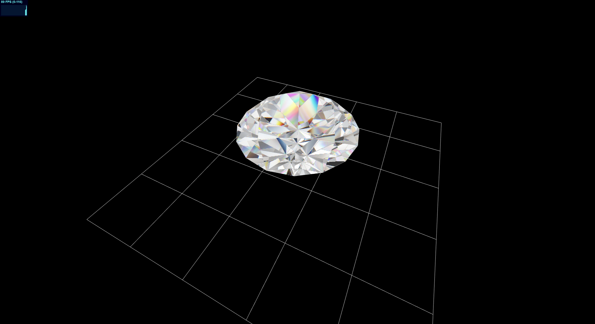

# Diamond Sample




## Installing

```
npm install
```

### Develop

```
npm run dev
```

### Build Production

```
npm run build
```

### Boilerplate

A Three.js Boilerplate for TypeScript Vite projects.

This boilerplate is supplementary to <!--my book titled [**Three.js and TypeScript**](https://amzn.to/3FahROZ) and--> my **ThreeJS and TypeScript** courses at [Udemy](https://www.udemy.com/course/threejs-tutorials/?referralCode=4C7E1DE91C3E42F69D0F) and [YouTube (Channel membership required)](https://www.youtube.com/playlist?list=PLKWUX7aMnlEKTmkBqwjc-tZgULJdNBjEd)
